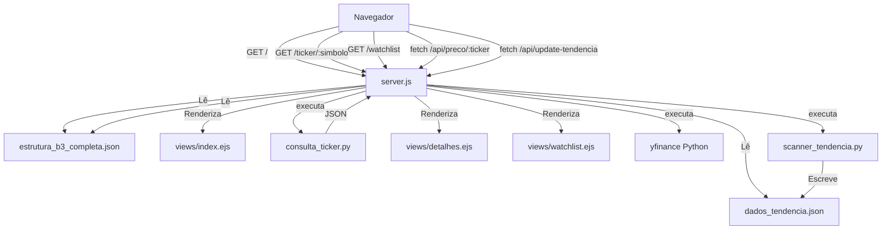

# Fluxo de Dados e Arquitetura

Este documento descreve o fluxo principal do projeto `Terminal Radar B3`, com foco em rotas, integração entre Node.js e Python, e como os dados são usados nas views.

## Visão rápida

- `src/backend/server.js` é o backend principal em Express.
- `views/*.ejs` são as páginas renderizadas.
- `consulta_ticker.py` fornece detalhes de um ticker via `yfinance`.
- `scanner_tendencia.py` gera `dados_tendencia.json` para o dashboard.
- A carteira (`watchlist.ejs`) usa `localStorage` no browser.

## Fluxo principal

### 1. Dashboard de tendência (`/`)

1. O usuário abre `/`.
2. O servidor lê `dados_tendencia.json` e `estrutura_b3_completa.json`.
3. Renderiza `views/index.ejs` com:
   - `dados.acoes` e `dados.bdrs`
   - `listaGlobal` para a pesquisa de ticker
4. O botão "Iniciar Scanner" chama `/api/update-tendencia`.

### 2. Watchlist (`/watchlist`)

1. O usuário abre `/watchlist`.
2. O servidor lê `estrutura_b3_completa.json`.
3. Renderiza `views/watchlist.ejs` com a lista global de tickers.
4. O frontend lê e grava `localStorage` para operações de compra/venda.
5. Para atualizações de preço, o browser consulta `/api/preco/:ticker`.

### 3. Detalhes de um ativo (`/ticker/:simbolo`)

1. O usuário acessa `/ticker/PETR4` ou outro símbolo.
2. O servidor concatena `.SA` quando necessário.
3. Executa `python consulta_ticker.py "<ticker>"`.
4. O script retorna JSON com métricas e resumo traduzido.
5. Renderiza `views/detalhes.ejs`.

### 4. APIs auxiliares

- `/api/preco/:ticker`
  - Obtém o preço atual via `yfinance` em Python.
- `/api/preco-historico? ticker=<ticker>&data=<YYYY-MM-DD>`
  - Obtém preço em data específica para o modal de operação.
- `/api/update-tendencia`
  - Executa `scanner_tendencia.py` e atualiza `dados_tendencia.json`.

## Como os dados fluem

- `estrutura_b3_completa.json`
  - fonte de verdade para ativos e nomes
  - usada no dashboard e na watchlist
- `dados_tendencia.json`
  - resultado do scanner de tendência
  - alimenta o dashboard principal
- `consulta_ticker.py`
  - gera dados técnicos e financeiros sob demanda
- `localStorage`
  - mantém a carteira do usuário sem backend persistente

## Diagrama de fluxo

## Notas de implantação

- O backend depende de Node.js / Express e Python.
- As bibliotecas Python principais são `yfinance` e `deep-translator`.
- Esta documentação foi criada via IA para registrar a arquitetura e o fluxo do projeto.
